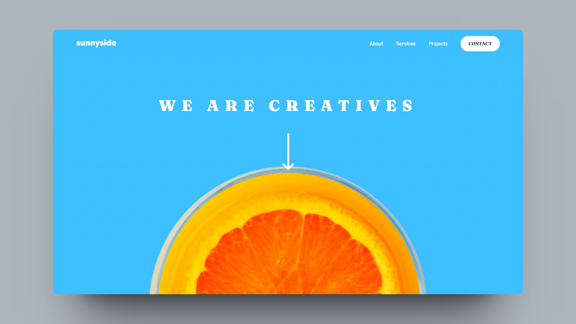

# Sunnyside Landing Page

## Tabela de conteúdos

- [Sobre o projeto](#sobre-o-projeto)
- [Screen Shots](#screen-shots)
  - [Web Responsivo (mobile)](#web-responsivo-mobile)
  - [Web Desktop](#web-desktop)
- [Como executar o projeto](#como-executar-o-projeto)
  - [Pré-requisitos](#pré-requisitos)
  - [Rodando o projeto](#rodando-o-projeto)
- [Tecnologias](#tecnologias)
- [Autor](#autor)

## Sobre o projeto

Uma landing page, para uma empresa fictícia, contendo várias sessões importantes de uma página de apresentação como: Hero, Testemunhas e e Footer.

Projeto desenvolvido conforme as instruções do desafio do site [Frontend Mentor](https://www.frontendmentor.io/challenges/sunnyside-agency-landing-page-7yVs3B6ef).

## Screen Shots

### Web Responsivo (Mobile)

<p>
  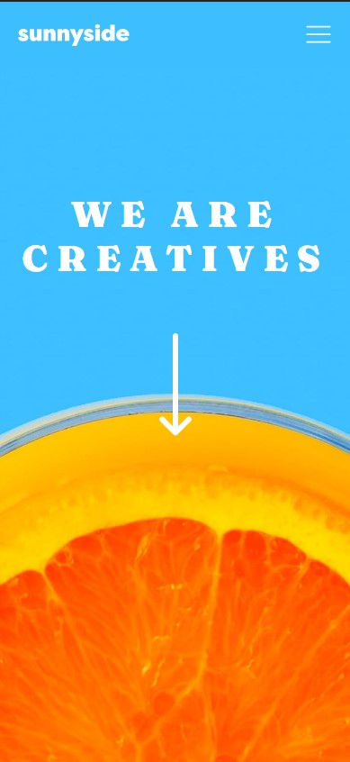
  
  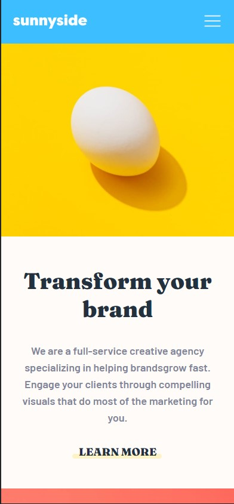

  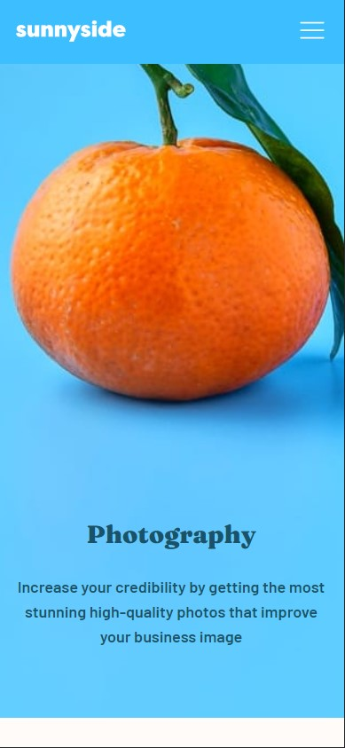
</p>

<p>
  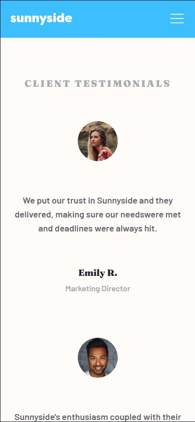
  
  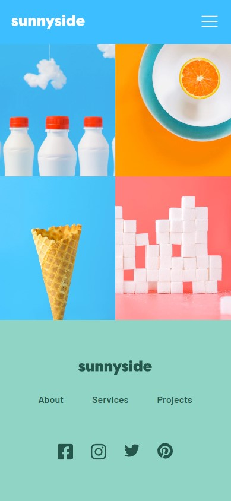
</p>

### Web Desktop

  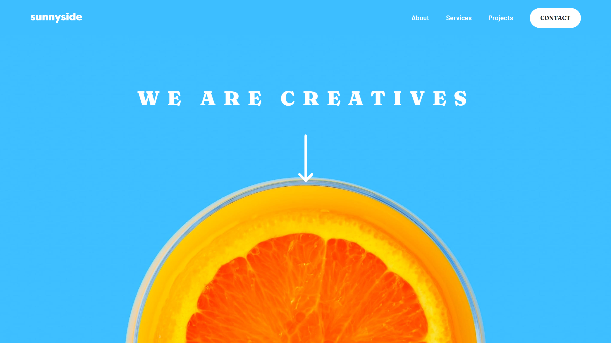
  
  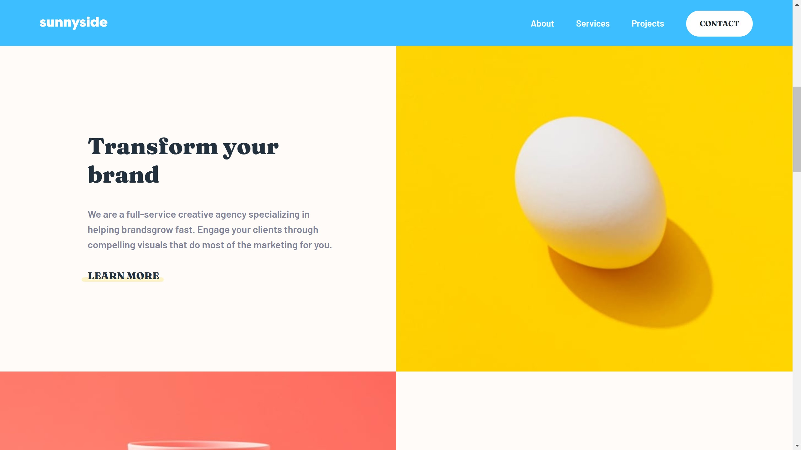

  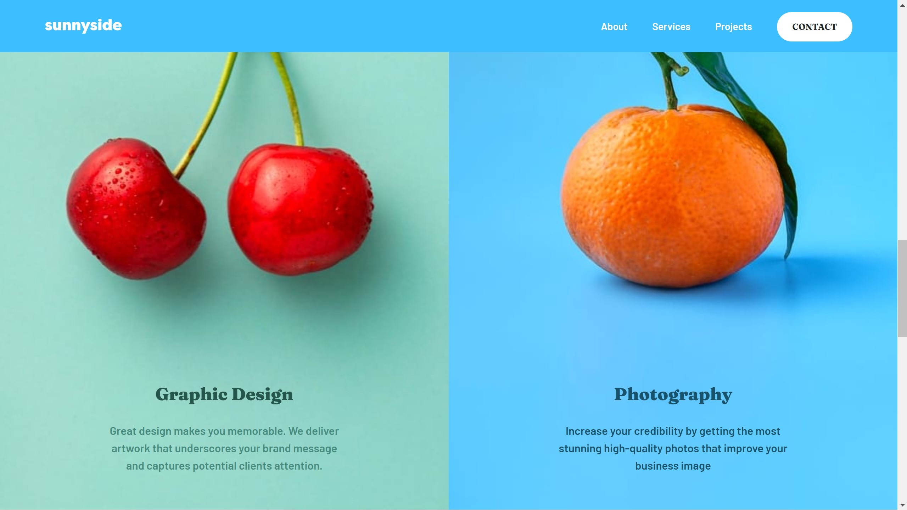

  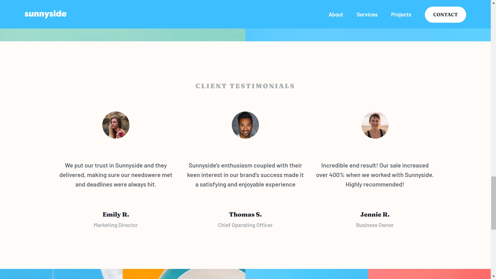

  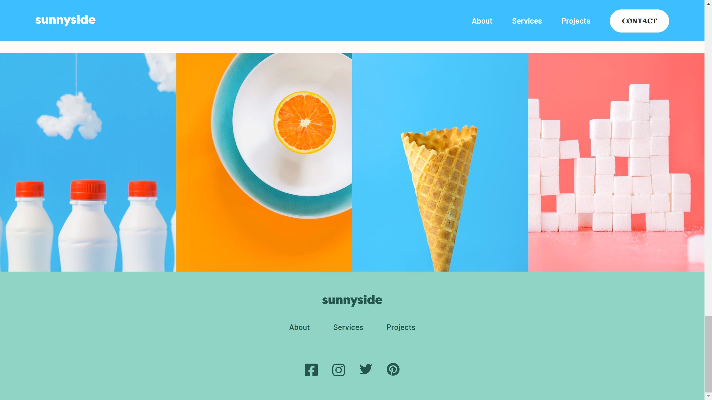

## Como executar o projeto

### Pré-requisitos

Para rodar o projeto, você precisa ter em sua máquina as seguintes ferramentas:
[Git](https://git-scm.com), [Node.js](https://nodejs.org/en/).

### Como rodar o projeto

- Para baixar o projeto é necessário seguir as instruções abaixo:

```bash
# Clone este repositório
$ git clone https://github.com/angelo-filho/sunnyside.git

# Acesse a pasta do projeto
$ cd sunnyside
```

- Instale as dependências e então inicialize o projeto

```bash
# Instale as dependências
$ yarn install

# Execute a aplicação em modo de desenvolvimento
$ yarn dev
```

ou

```bash
# Instale as dependências
$ npm install

# Execute a aplicação em modo de desenvolvimento
$ npm run dev
```

O servidor iniciará na porta:3000 - acesse http://localhost:3000

### Tecnologias

As seguintes ferramentas foram usadas na construção do projeto:

- [React](https://pt-br.reactjs.org/)
- [Styled Components](https://styled-components.com/)
- [Styled Icons](https://styled-icons.dev/)

### Autor

<a href="https://github.com/angelo-filho">
  
  <br />
  <sub><b>Angelo Filho</b></sub>
</a>

[](https://www.linkedin.com/in/angelo-filho-4a44a8190/)
[](mailto:angelo.filho06@gmail.com)

Feito com ❤️ por Angelo Filho. Entre em contato!
